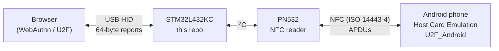

# U2F_Connect_STM32

Firmware for an STM32L432KC that turns a phone into a **FIDO U2F security key**.

The microcontroller enumerates on the PC as a FIDO U2F HID device, so the browser treats it like any hardware security key. Instead of holding keys itself, it forwards every U2F request over NFC (via a PN532 reader) to an Android app, which generates and stores the keys in the Android Keystore and signs the challenges. The board is just a bridge; the phone is the authenticator.

All of the protocol handling – U2FHID framing, the PN532 driver and the custom NFC transport between the board and the phone – was written from scratch as part of my engineering thesis.

> This work was created as part of the educational process at the Polish-Japanese Academy of Information Technology (PJATK).
> *Utwór powstał w wyniku realizowania procesu edukacyjnego w PJATK.*

The companion Android app lives here: **[U2F_Android](https://github.com/OlderHermit/U2F_Android)**.

## How it works



1. **PC ↔ STM32 – U2FHID.** The board presents itself as a USB HID device with the FIDO Alliance usage page (`0xF1D0`). It reassembles the host's 64-byte init/continuation reports into a full U2F message, allocates a channel ID on `U2FHID_INIT` (using the hardware RNG), and handles `MSG` (`REGISTER`, `AUTHENTICATE`, `VERSION`) and `PING`.
2. **STM32 ↔ PN532 – custom I²C driver.** A small driver builds and validates PN532 information frames (length/data checksums, ACK handling) and uses `SAMConfiguration`, `InListPassiveTarget` and `InDataExchange` to find the phone and talk to it.
3. **PN532 ↔ phone – custom transport over HCE.** The phone runs a Host Card Emulation service registered for the AID `F0 05 04 03 02 01 A1`. Each request is wrapped in a `SELECT AID` APDU that carries the U2FHID channel ID, a packet counter and the U2F payload. The phone responds with `90 00` on success.

### Why the extra packetization layer

U2F messages don't fit in one NFC exchange. A registration response alone is around 400+ bytes (public key, key handle, attestation certificate, signature). The PN532 frame format itself isn't the bottleneck – extended frames allow far longer payloads – but the chip's internal buffer is only about 265 bytes, and anything larger fails with errors.

So on top of the PN532 framing there is a second, application-level layer that keeps every exchange safely under that limit:

- **Requests (STM32 → phone)** are split into chunks of up to 200 bytes. Every chunk repeats the channel ID and the U2F header and carries a "packets remaining" counter, so the phone can rebuild the full message and knows when it is complete. The phone acknowledges each chunk.
- **Responses (phone → STM32)** start with a byte saying how many parts the response has. If there is more than one, the board requests the rest one by one with a custom `Continue` command (`0x04`) that names the part index.
- **Resilience.** If the PN532 reports the target was lost mid-transfer, the firmware polls for the phone again and continues from the part it was on, so you can move the phone away and tap again. On the phone side the partial message is cached per channel for up to 5 minutes.

## Hardware

| Part | Notes |
| --- | --- |
| STM32L432KC | Cortex-M4, built-in USB FS device and hardware RNG |
| PN532 NFC module | Set to **I²C mode** (address `0x24`) |
| USB connector | Wired to the MCU's USB pins (for the U2F HID device) |
| Android phone with NFC | Running [U2F_Android](https://github.com/OlderHermit/U2F_Android) |

### Pinout

| STM32 pin | Function | Connect to |
| --- | --- | --- |
| PA9 | I2C1 SCL | PN532 SCL |
| PA10 | I2C1 SDA | PN532 SDA |
| PA11 | USB D− | USB connector D− |
| PA12 | USB D+ | USB connector D+ |
| PA2 / PA3 | USART2 TX / RX | Debug log, 115200 8N1 |

USB identity: VID `2414` (0x096E), PID `2128` (0x0850), product string `STM32 U2F`.

### Linux permissions (udev)

On Linux the browser talks to the key through `/dev/hidraw*`, which by default is accessible only to root. Older U2F udev rules grant access by VID/PID, which is why the firmware reuses an existing security-key VID/PID (`096E:0850`, Feitian): during development the browser couldn't open the device with an unrecognised ID.

## Building and flashing

The project was generated with STM32CubeMX (STM32Cube FW_L4 V1.18.0) and built in **STM32CubeIDE**.

1. Clone the repository.
2. In STM32CubeIDE choose *File → Import → Existing Projects into Workspace* and select the `test_nfc` folder.
3. Build and flash with the included `test_nfc Debug` launch configuration.
4. Connect a serial terminal to USART2 (PA2/PA3) at 115200 baud to watch the log (PN532 firmware version, channel IDs, NFC transfer progress).

## Usage

1. Install and open the [Android app](https://github.com/OlderHermit/U2F_Android); make sure NFC is enabled.
2. Plug the board into the PC. It shows up as a FIDO security key.
3. Register a security key on a site (or a test page such as webauthn.io).
4. When the browser asks you to use your key, hold the phone on the PN532 antenna until the operation finishes.
5. Logging in works the same way: the browser sends an authentication request and the phone signs it.

## Project structure

```
test_nfc/
├── Core/
│   ├── Inc/pn532-i2c.h, Src/pn532-i2c.c        # PN532 driver: frames, ACK, checksums, InDataExchange
│   ├── Inc/fido_u2f_hid.h                       # U2FHID / U2F command definitions, AID, transfer limits
│   └── Src/main.c                               # Peripheral init, PN532 setup
├── USB_DEVICE/App/
│   ├── usbd_custom_hid_if.c                     # U2FHID report descriptor, packet reassembly,
│   │                                            # request handling and NFC packetization
│   └── usbd_desc.c                              # USB descriptors (VID/PID, strings)
├── Drivers/, Middlewares/                       # STM32 HAL and USB Device library (generated by CubeMX)
└── test_nfc.ioc                                 # CubeMX configuration
```

## Status and limitations

This is a working proof of concept built for a thesis, not a production security key.

- **FIDO U2F (CTAP1) only.** FIDO2 / CTAP2 is not implemented, so there is no passwordless login or resident keys.
- **Tested on Linux only.**
- `WINK` and `LOCK` are not supported, and only one channel is handled at a time.
- NFC operations block until the phone is found; there is no timeout yet.
- Attestation uses a certificate generated on the phone rather than a vendor attestation certificate.

## Related

- [U2F_Android](https://github.com/OlderHermit/U2F_Android) – the Android (Kotlin) app that acts as the authenticator.
- [FIDO U2F HID Protocol Specification](https://fidoalliance.org/specs/fido-u2f-v1.2-ps-20170411/fido-u2f-hid-protocol-v1.2-ps-20170411.html)
- [FIDO U2F Raw Message Formats](https://fidoalliance.org/specs/fido-u2f-v1.2-ps-20170411/fido-u2f-raw-message-formats-v1.2-ps-20170411.html)
- [PN532 User Manual (NXP UM0701-02)](https://www.nxp.com/docs/en/user-guide/141520.pdf)

## License

The original code in this repository is licensed under the [Apache License 2.0](LICENSE). It was created as part of the educational process at PJATK, which holds a non-exclusive license to it. The Apache license covers the PN532 driver (`pn532-i2c.c/.h`), the U2F definitions (`fido_u2f_hid.c/.h`) and the code inside the `USER CODE` sections of the CubeMX-generated files.

Third-party components bundled with the project keep their own licenses, found in the `LICENSE.txt` file in each component's folder:

| Component | License |
| --- | --- |
| `Drivers/STM32L4xx_HAL_Driver` | BSD-3-Clause |
| `Drivers/CMSIS` | Apache-2.0 |
| `Middlewares/ST/STM32_USB_Device_Library` | ST SLA0044 |
| CubeMX-generated code outside `USER CODE` sections | STMicroelectronics, see file headers |

## Author

Zdzisław Małachowski
